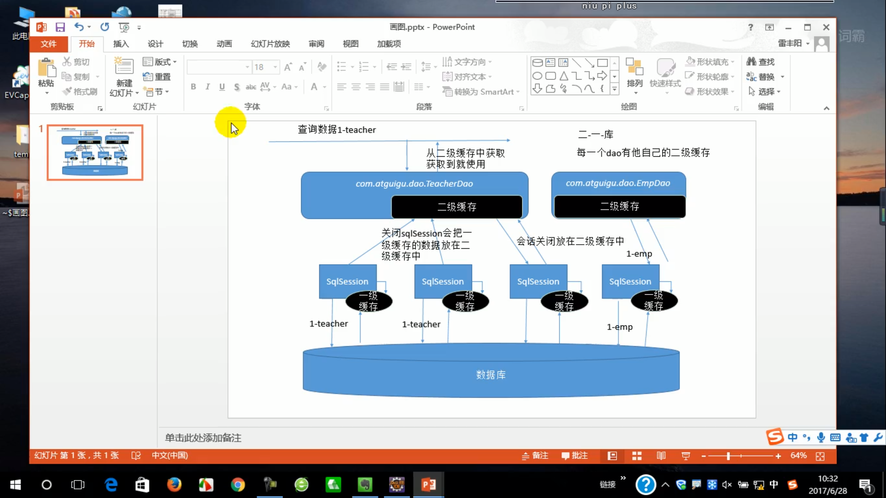

IOC(Inversion（翻转）Of Control):控制反转
    控制：资源的获取方式:
        主动式：（要什么资源都自己去创建）
                eg：
                    bookServlet{
                                BookService bs = new BookService()
                                AirPlane ap= new Airplane()//如果是个复杂的对象很麻烦
                                }
        被动式:资源的获取不是主动去创建 交个一个容器去创建
            BookServlet{
                BookService bs;
                public void test01(){
                            bs.checkout()
                        }
            }

容器：管理所有组件（有功能的类） 
        假设： BookServlet受容器管理 BookSerice也受容器管理
              容器可以自动探查出哪些组件用到另一些组件  容器可以帮我们创建BookService对象 并把BookService对象赋值过去

容器：主动的new资源变为被动的接受资源

容器：类似于婚介所 主动获取变成被动接受
    
DI（dependency injection)依赖注入
        容器能知道哪个组件(类)运行的时候 需要另外一个类（组件）
        容器通过反射的形式 把准备好的BookService对象注入（利用反射给属性赋值）到BookServlet中
    
只要是容器管理的组件都能使用容器提供的强大功能

helloWorld 以前是自己new对象 现在所有的对象交给容器创建 给容器中注册组件（就是创建对象）

